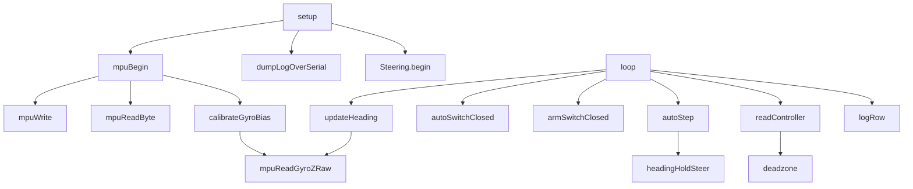

# `auto_mode_xbox_controller/main/sketch.cpp` — explained

Firmware for the boat with **two modes**: radio control (Xbox pad over Bluetooth) and
**autonomous** (a fixed sequence, steered with an MPU-6050 gyroscope). It also
**records a log to flash** so you can read the run after the boat is out of the water,
with no cable attached.

> Status: compiles (`pio run -e esp32dev`), **not yet tested on the boat**. Every
> number marked *TODO / to calibrate* below is a first guess.

Files in this folder:

| File | What it is |
|---|---|
| `AUTO_MODE_SKETCH.md` | this document |
| `diagramas/estados-auto.archify.html` | state machine of the autonomous mode |
| `diagramas/ciclo-loop.archify.html` | what happens in one `loop()` cycle (every 10 ms) |
| `diagramas/log-datos.archify.html` | how the log gets from the water to the analysis script |

The diagrams are interactive standalone HTML (open in a browser; they have zoom, search and
light/dark themes). Each has its `.archify.json` source next to it. They are written in
Spanish, like the rest of the student material.

---

## 1. The big picture

Everything is built around **one struct, `Command`**, that carries "what the boat should
do right now": `throttle`, `steer`, `armed`. Two different *sources* fill it, and one
*sink* consumes it:

```
  Xbox pad ──► readController() ─┐
                                 ├──► Command cmd ──► slew + DUTY_CAP ──► drive.set()  (motor)
  autoStep() (state machine) ────┘                                    └──► steer.set()  (rudder servo)
        ▲
        └── headingDeg  ◄── updateHeading() ◄── MPU-6050 (gyro Z)

  ARM switch (pin 32) ── overrides everything: armed=false
  AUTO switch (pin 26) ─ chooses which source fills `cmd`
```

The actuators (`PaddleDrive`, `Steering`) know nothing about who produced the command.
That is why RC and autonomous share the exact same safety path.

### Call graph



The most connected pieces — the ones to understand first — are `Command`, `loop()`,
`mpuBegin()` and `readController()`. See `diagramas/ciclo-loop.archify.html` for the same
cycle as a picture.

---

## 2. Constants and variables at the top

### 2.1 Pins

| Name | Value | Meaning |
|---|---|---|
| `PIN_DRIVE_A`, `PIN_DRIVE_B` | 27, 13 | Motor driver inputs, port **M0**. PWM on A = forward, PWM on B = reverse (the other stays 0). |
| `PIN_STEER` | 25 | Rudder servo signal ("Servo" header). |
| `PIN_LED` | 33 | Status LED. Solid = armed, blinking = idle/disarmed. |
| `PIN_ARM_SWITCH` | 32 | **Kill switch.** `INPUT_PULLUP`: switch closed to GND → `LOW` → armed. Open (or wire fell off) → `HIGH` → disarmed. Fails safe. |
| `PIN_AUTO_SWITCH` | 26 | **Autonomous-mode switch** (the physical switch the challenge requires). Closed = `LOW` = autonomous. Same `INPUT_PULLUP` scheme. |
| `PIN_SDA`, `PIN_SCL` | 21, 22 | I²C bus to the MPU-6050 (ESP32 default pins). |

### 2.2 PWM

| Name | Value | Meaning |
|---|---|---|
| `MOT_FREQ` | 5000 Hz | Motor PWM frequency. 5 kHz because that is what the motor driver can follow. |
| `MOT_BITS` | 10 | Motor PWM resolution → 1024 steps. |
| `MOT_MAX` | 1023 | `(1 << MOT_BITS) - 1`, the value meaning 100 % duty. |
| `SRV_FREQ` | 50 Hz | Standard hobby-servo frame rate (20 ms period). |
| `SRV_BITS` | 16 | Servo PWM resolution (65 536 steps per period) — fine enough for microsecond pulses. |
| `SRV_PERIOD_US` | 20 000 µs | One servo period = 1 / 50 Hz. |
| `STEER_CENTER_US` | 1500 µs | Pulse width for "rudder straight". |
| `STEER_RANGE_US` | 750 µs | Pulse swing each side: steer −1 → 750 µs, +1 → 2250 µs. |

### 2.3 Control tunables

| Name | Value | Meaning |
|---|---|---|
| `DEADZONE` | 0.06 | Stick/trigger values smaller than this are forced to 0 (RC only) so the boat doesn't creep at rest. |
| `THROTTLE_SLEW` | 4.0 /s | Max rate the applied throttle may change per second. 0 → 0.8 takes ≈ 0.2 s. Protects the motor and gears from instant jumps. |
| `DUTY_CAP` | **0.80** | Multiplier applied to the throttle just before the motor: `applied = throttle × DUTY_CAP`. A throttle of 1.0 = **80 % duty**. Measured: below ~80 % the boat does not move. It is also an upper limit: the motor is 6 V on a 7.4 V pack, so do not raise it without a reason. |

**Important:** `DUTY_CAP` is a *multiplier*, not a floor. Because of that, the autonomous
sequence commands `throttle = 1.0` (→ 80 % duty). A throttle of 0.7 would give only 56 %
and the boat would not move.

### 2.4 Flash log

| Name | Value | Meaning |
|---|---|---|
| `LOG_INTERVAL_MS` | 50 ms | One row every 50 ms (≈ 20 Hz). |
| `LOG_FLUSH_MS` | 1000 ms | The file is really written to flash once per second, not per row (saves flash wear/time). |
| `LOG_PATH` | `"/log.csv"` | File inside LittleFS. |
| `logFile` | `File` | Open file handle for appending. |
| `lastLogMs`, `lastFlushMs` | ms | Timestamps of the last row / last flush, used to rate-limit. |

### 2.5 MPU-6050

| Name | Value | Meaning |
|---|---|---|
| `MPU_ADDR` | 0x68 | I²C address (AD0 tied to GND). |
| `REG_PWR_MGMT1` | 0x6B | Power register. The chip boots asleep; writing 0 wakes it. |
| `REG_GYRO_CFG` | 0x1B | Gyro range register. 0 = ±250 °/s. |
| `REG_GYRO_ZH` | 0x47 | First byte (high) of the Z-axis gyro reading; the low byte follows at 0x48. |
| `REG_WHO_AM_I` | 0x75 | ID register; a MPU-6050 answers 0x68. Used to verify the sensor is really there. |
| `GYRO_LSB_PER_DPS` | 131.0 | Sensitivity at ±250 °/s: 131 raw counts = 1 °/s. |

Runtime variables:

| Name | Meaning |
|---|---|
| `gyroOK` | `true` if the sensor answered correctly at boot. If `false`, heading hold is disabled (steer correction = 0) and the boat drives "blind" on timers. |
| `gyroZBiasRaw` | Average raw reading measured while the boat sits still at boot. A gyro never reads exactly 0 at rest; this offset is subtracted from every reading. |
| `headingDeg` | Heading in degrees, **relative** to when auto mode started (reset to 0 at that moment). Not a compass: it only says "how much have I rotated". |
| `lastGyroZDps` | Latest yaw rate in °/s, cached so the log can reuse it without a second I²C read. |

### 2.6 Autonomous-mode tunables (all *to calibrate*)

| Name | Value | Meaning |
|---|---|---|
| `STEER_KP` | 0.02 | Proportional gain: steer correction per degree of heading error. 10° off → 0.2 steer. Too low = drifts, too high = zig-zags. |
| `STEER_MAX_CORR` | 0.35 | The correction is clamped to ±0.35 so it can never demand a huge rudder swing. |
| `TURN_TARGET_DEG` | 70° | How much heading change counts as "finished the turn around the buoy". |
| `TURN_STEER_CMD` | 0.6 | Fixed rudder command during the turn. |
| `STRAIGHT1_MS_CAP` | 4000 ms | Duration of the first straight leg (it ends by time — there is no distance sensor). |
| `TURN_MS_CAP` | 3000 ms | Safety net: leave the turn after this long even if 70° was never measured. |
| `STRAIGHT2_MS_CAP` | 5000 ms | Duration of the last straight leg. |

### 2.7 State variables

| Name | Meaning |
|---|---|
| `autoState` | Current state (`AUTO_STRAIGHT1`, `AUTO_TURN`, `AUTO_STRAIGHT2`, `AUTO_DONE`). |
| `autoStateStartMs` | `millis()` when the current state began; `elapsed = now − autoStateStartMs`. |
| `headingRef` | The heading the current straight leg tries to hold (the heading at the start of that leg). |
| `cmd` | The current `Command`, whichever source produced it. |
| `applied` | The slew-limited, capped throttle actually sent to the motor (this **is** the real duty, 0..0.8). |
| `lastLoop` | `millis()` of the previous loop iteration, to compute `dt`. |
| `lastAutoSwitch` | Previous state of the auto switch, to detect the *moment* it closes (edge). |
| `autoActive` | `true` while the autonomous sequence is running. |
| `pad` | Pointer to the connected Bluepad32 controller (null if none). |

---

## 3. Function by function

### Logging

- **`dumpLogOverSerial()`** — (name is historical; it prints through `Console`). Runs once
  in `setup()`. If a `/log.csv` from the previous run exists, prints it between
  `===LOG_START===` and `===LOG_END===`, then **deletes it**. It uses `Console`, not
  `Serial`, because Bluepad32 owns the USB console in this project.
- **`logRow(...)`** — called every loop; writes one CSV row at most every 50 ms:
  `t_ms, modo, throttle, steer, gyro_z_dps, heading_deg, duty`.
  `throttle` is the command *before* the cap; `duty` is the real applied value.
  Flushes to flash once per second.

### MPU-6050

- **`mpuWrite(reg, val)`** — writes one byte to a register over I²C.
- **`mpuReadByte(reg)`** — reads one byte (used for WHO_AM_I).
- **`mpuReadGyroZRaw()`** — reads two bytes at 0x47/0x48 and joins them into a signed
  16-bit number (`hi << 8 | lo`).
- **`calibrateGyroBias()`** — averages 200 readings (≈ 0.6 s) with the boat **still** and
  stores the result in `gyroZBiasRaw`.
- **`mpuBegin()`** — starts I²C, wakes the chip, sets ±250 °/s, checks WHO_AM_I == 0x68,
  calibrates. Returns `false` if the sensor isn't the expected one.
- **`updateHeading(dt)`** — every loop: `rate = (raw − bias) / 131` in °/s, then
  `headingDeg += rate × dt`. This is *integration*: angle = sum of rate × time.

### Actuators

- **`PaddleDrive`** — `set(t)` takes −1..1. It converts `|t|` to a 10-bit duty and puts
  it on pin A (forward) or pin B (reverse), zero on the other. `stop()` zeroes both.
- **`Steering`** — `set(s)` takes −1..1, converts to a pulse of 1500 ± 750 µs, then to
  the 16-bit PWM count `us × 65536 / 20000`.

### Inputs

- **`onConnect` / `onDisconnect`** — Bluepad32 callbacks that set/clear `pad`.
- **`deadzone(v)`** — zero if `|v| < DEADZONE`.
- **`armSwitchClosed()`, `autoSwitchClosed()`** — true when the pin reads `LOW`.
- **`readController(cmd)`** — fills `cmd` from the pad: throttle = RT − LT (each 0..1023
  scaled to 0..1), steer = left stick X (−512..512 scaled to −1..1), both through the
  deadzone. Returns `false` if no pad is connected.

### Autonomous mode

- **`headingHoldSteer(target)`** — the proportional controller:
  `err = headingDeg − target`; `steer = −STEER_KP × err`, clamped to ±0.35.
  Returns 0 if `gyroOK` is false.
- **`autoStep(now)`** — the state machine (next section). Returns a `Command`.

### `setup()`

1. Configure LED and both switches (`INPUT_PULLUP`).
2. Mount LittleFS; dump and delete the previous log; open a new log (header row if new).
3. Start motor and servo PWM (`drive.begin()`, `steer.begin()`), both at neutral.
4. `gyroOK = mpuBegin()` — **keep the boat still during boot**.
5. Start Bluepad32.

### `loop()` (every ~10 ms)

1. Compute `dt`; `updateHeading(dt)`.
2. Read the auto switch. On the *closing edge*: `autoActive = true`, state =
   `AUTO_STRAIGHT1`, `headingDeg = 0`, `headingRef = 0`. When the switch opens:
   `autoActive = false`.
3. Fill `cmd`: `autoStep()` if `autoActive`, otherwise read the pad
   (`BP32.update()` + `readController`; no pad → `armed = false`).
4. **Kill switch:** if the arm switch is open → `cmd.armed = false` and `autoActive = false`.
5. Throttle: `target = armed ? throttle × DUTY_CAP : 0`; `applied` moves toward `target`
   by at most `THROTTLE_SLEW × dt`.
6. `drive.set(applied)`; `steer.set(armed ? steer : 0)`.
7. `logRow(...)` including `applied` as `duty`.
8. LED and `delay(10)`.

---

## 4. The autonomous state machine

```
        auto switch closes
                │  headingDeg = 0
                ▼
      ┌──────────────────┐  after STRAIGHT1_MS_CAP   ┌────────────────────┐
      │  AUTO_STRAIGHT1  │ ────────────────────────► │     AUTO_TURN      │
      │ throttle 1.0     │      headingRef = now     │ throttle 1.0       │
      │ steer = hold(ref)│                           │ steer = +0.6 fixed │
      └──────────────────┘                           └─────────┬──────────┘
                                                               │ |heading − ref| ≥ 70°
                                                               │  OR  TURN_MS_CAP
                                                               ▼
      ┌──────────────────┐  after STRAIGHT2_MS_CAP   ┌────────────────────┐
      │    AUTO_DONE     │ ◄──────────────────────── │  AUTO_STRAIGHT2    │
      │ throttle 0       │                           │ throttle 1.0       │
      │ steer 0          │                           │ steer = hold(ref)  │
      └──────────────────┘                           └────────────────────┘
```

| State | Output | Exit condition |
|---|---|---|
| `AUTO_STRAIGHT1` | throttle 1.0, steer = heading hold on `headingRef` | `elapsed ≥ STRAIGHT1_MS_CAP` (**time**) |
| `AUTO_TURN` | throttle 1.0, steer = `TURN_STEER_CMD` | heading changed ≥ `TURN_TARGET_DEG` (**gyro**) or `elapsed ≥ TURN_MS_CAP` (safety) |
| `AUTO_STRAIGHT2` | throttle 1.0, steer = heading hold on the new `headingRef` | `elapsed ≥ STRAIGHT2_MS_CAP` (**time**) |
| `AUTO_DONE` | throttle 0, steer 0 | stays until the switch is reopened |

Key idea: **the gyro decides *how* each leg is executed** (stay straight, turn exactly
70°) **but not *when* to start turning** — that is still a timer, because the boat has no
sensor telling it where the buoy is.

At the start of each leg, `headingRef` is set to the *current* `headingDeg`, so the hold
controller always tries to keep "the direction I'm pointing right now".

### How much steering was used?

The gyro does **not** measure the rudder. The firmware knows the steer value because it is
the number it commanded (`cmd.steer`), and it logs it. The gyro measures the *result*
(how fast the boat rotated). Logging both gives a command → response pair per row. Note
there is no feedback of the real servo angle.

---

## 5. Data flow of the log

```
during the run:  logRow() → /log.csv (LittleFS, flash)      ← no cable in the water
after the run:   plug USB, open a serial monitor, RESET the board
                 setup() → dumpLogOverSerial() → ===LOG_START=== rows ===LOG_END===
                 save to a file → python3 ../autonomo_borradores/analizar_log.py captura.txt
```

Columns: `t_ms, modo (1=auto, 0=RC), throttle, steer, gyro_z_dps, heading_deg, duty`.

---

## 6. Known limitations / things to verify

1. **The dump deletes the log.** If you reset without a serial monitor open, that run's
   data is lost.
2. **Sign conventions untested.** Rotate the boat clockwise by hand and confirm
   `headingDeg` rises; confirm `steer > 0` turns the boat the same way `headingDeg` rises,
   otherwise `headingHoldSteer` pushes the wrong way.
3. **No I²C error check** in `mpuReadGyroZRaw()`. A failed read can inject garbage into
   the heading; the time caps are the only protection.
4. **Auto switch already closed at power-up** starts auto mode immediately
   (`lastAutoSwitch` starts `false`).
5. **Gyro drift.** Integrated heading drifts slowly; fine for a short run, not for minutes.
6. **Keep the boat still at boot** so the bias calibration is valid.
7. Yaw is only correct if the MPU-6050 is mounted flat with its Z axis vertical.
8. All values in section 2.6 are first guesses — calibrate with the log and
   `analizar_log.py`.
